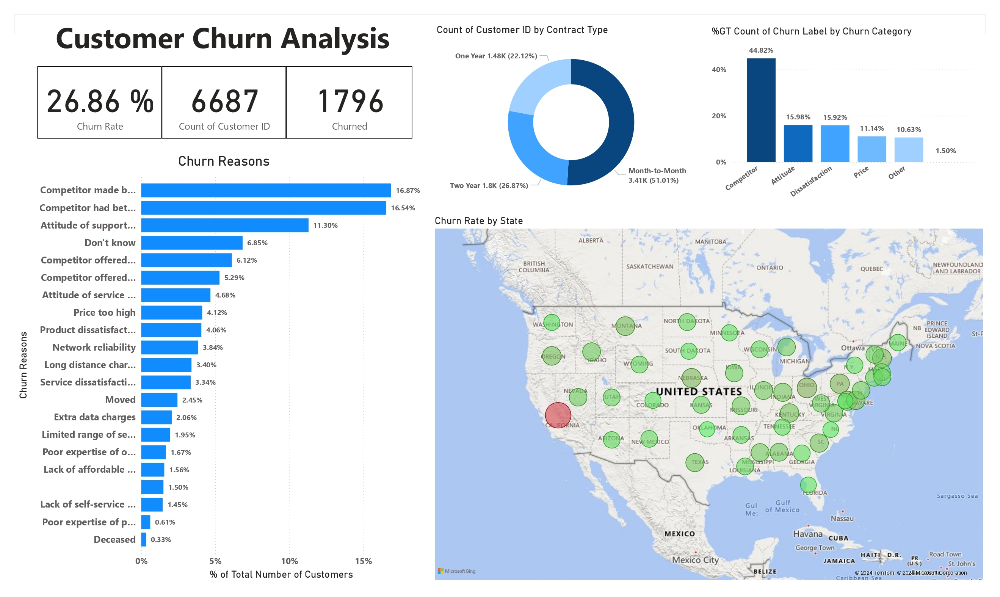

# Customer Churn Analysis with Power BI

## Table of Contents
1. [Project Background](#project-background)
2. [Data Source](#data-source)
3. [Executive Summary](#executive-summary)
4. [Insights Deep Dive](#insights-deep-dive)
5. [Recommendations](#recommendations)
6. [Assumptions and Caveats](#assumptions-and-caveats)

---

## Project Background
This project is a Power BI analysis of customer churn for a fictional telecom company, Databel, based on a guided case study provided by DataCamp. For subscription-based businesses like Databel, understanding and reducing customer churn is essential for long-term profitability. This analysis aims to determine churn rates, identify key reasons for customer attrition, and provide insights that can help Databel reduce future churn.

The project involves:
1. **Exploratory Analysis** – An initial overview of the dataset, including calculated measures to understand churn rates.
2. **Investigating Churn Patterns** – A deeper dive into potential causes of churn.
3. **Visualizing the Analysis** – Creation of an interactive, dashboard-style report to communicate findings to stakeholders.

---

## Data Source
The dataset contains anonymized information on customer demographics, service usage, and account details. Key metrics and dimensions include:

- **North Star Metrics:**
  - **Churn Rate:** Percentage of customers who have left Databel.
  - **Customer Count:** Total number of customers included in the dataset.
  - **Churn Reasons:** Primary reasons for customer churn, as categorized by customer feedback.

- **Key Dimensions:**
  - **Demographics:** Includes fields like age, gender, state, and customer groups (e.g., under 30 or senior).
  - **Service Type:** Includes contract types (e.g., month-to-month, one year, two years) and plan options (e.g., international and data plans).
  - **Account Attributes:** Monthly charges, account length, total charges, and churn category.

---

## Executive Summary
The analysis reveals a churn rate of **26.86%**, meaning 1,796 customers out of a total of 6,687 have churned. Key findings include:
- **Primary Churn Drivers:** Competition-related issues, dissatisfaction with customer support, and price concerns are the main drivers of churn.
- **Contract Type Correlation:** Most churned customers were on month-to-month contracts, indicating a potential area for intervention to enhance customer retention.

These insights suggest that focusing on competitive pricing, enhancing customer support, and encouraging longer-term contracts may help reduce churn.

---

## Insights Deep Dive
### Churn Reasons
- The top reason for churn is "Competitor made better offer" (16.87%), followed by "Competitor had better devices" (16.54%) and "Attitude of support person" (11.30%).
  
### Contract Type and Churn
- Customers on month-to-month contracts represent **51.01%** of total churn. This indicates that flexible contract types may contribute to a higher churn rate due to a lack of commitment.

### Geographic Insights
- The churn map shows that certain states, like California, have significantly higher churn rates. Regional churn insights can guide targeted marketing or customer support interventions.

---

## Recommendations
1. **Enhance Retention Programs**: Offer loyalty incentives or discounts to customers on month-to-month contracts to encourage them to switch to annual or biannual contracts.
2. **Competitive Pricing Adjustments**: Consider introducing competitive pricing tiers and bundled plans to retain price-sensitive customers.
3. **Improve Customer Service Quality**: Invest in customer service training and resources to address dissatisfaction with support, a leading cause of churn.

---

## Assumptions and Caveats
- **Data Completeness**: Some fields contain blank values that were filled through calculated columns in Power BI, which may affect the precision of certain metrics.
- **External Influences**: External market conditions and competitor activities may impact churn rates but are not reflected in this dataset.
- **Limitations of Model**: The analysis assumes that reasons for churn in the dataset accurately reflect customer sentiments, but this might not cover all underlying factors.